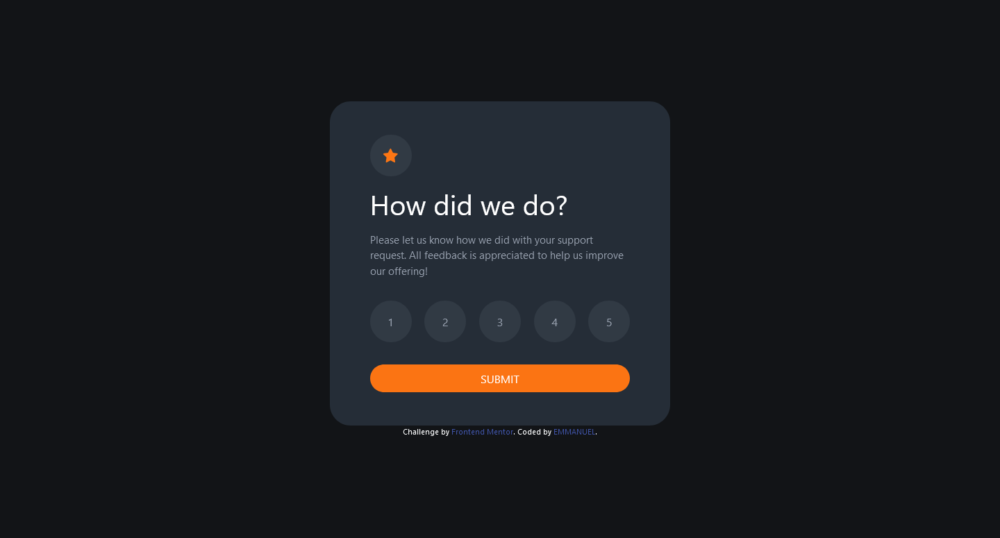

# Frontend Mentor - Interactive rating component solution

This is a solution to the [Interactive rating component challenge on Frontend Mentor](https://www.frontendmentor.io/challenges/interactive-rating-component-koxpeBUmI). Frontend Mentor challenges help you improve your coding skills by building realistic projects. 

## Table of contents

- [Overview](#overview)
  - [The challenge](#the-challenge)
  - [Screenshot](#screenshot)
  - [Links](#links)
- [My process](#my-process)
  - [Built with](#built-with)
  - [What I learned](#what-i-learned)
  - [Continued development](#continued-development)
- [Author](#author)

## Overview

### The challenge

Users should be able to:

- View the optimal layout for the app depending on their device's screen size
- See hover states for all interactive elements on the page
- Select and submit a number rating
- See the "Thank you" card state after submitting a rating

### Screenshot



### Links

- Solution URL: [Solution url](https://github.com/Damilarr/Interactive-rating-component)
- Live Site URL: [live site URL](https://your-live-site-url.com)

## My process

### Built with

- HTML
- CSS custom properties
- Flexbox
- BOOTSTRAP V4
- Mobile-first workflow
- Javascript
### What I learned

I was able to improve my bootstrap skills and learn some CSS concepts like 
```css
 .bdy{
  position: fixed !important;
  top: 0; 
  left: 0;
  right: 0;
  bottom: 0;
  background: hsl(216, 12%, 8%);
  max-width: 100%;
}
```
### Continued development
I still plan to write a better function to get and set the rated value for the buttons.

## Author
- Website - [EMMANUEL](https://github.com/Damilarr)
- Frontend Mentor - [@Damilarr](https://www.frontendmentor.io/profile/Damilarr)
- Twitter - [@Emmdam4](https://twitter.com/Emmdam4)

